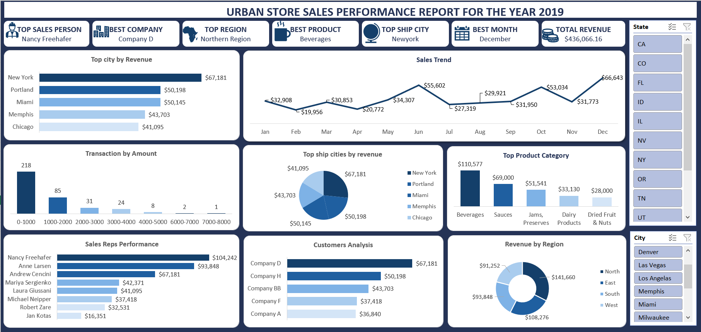
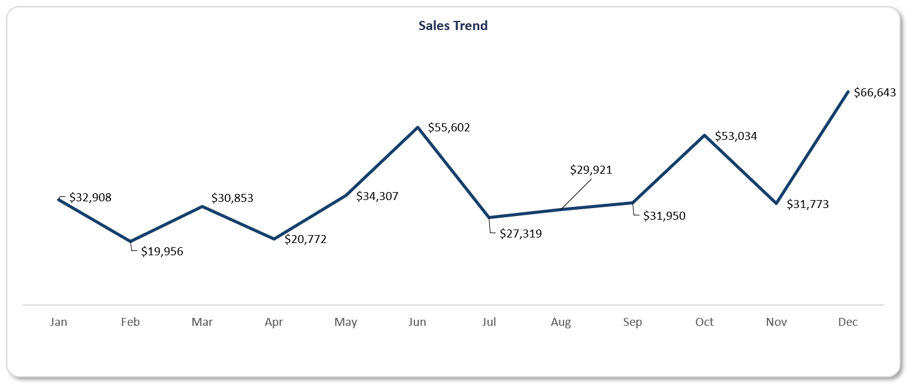
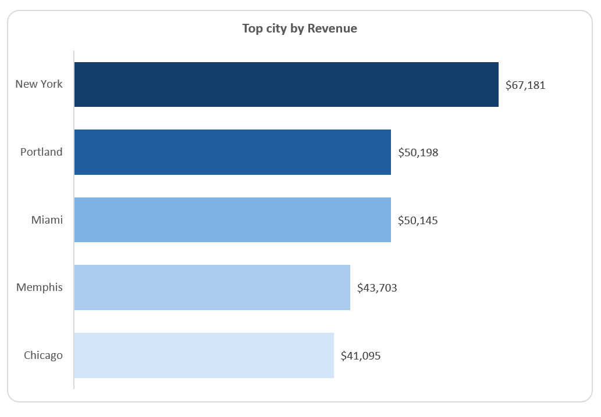
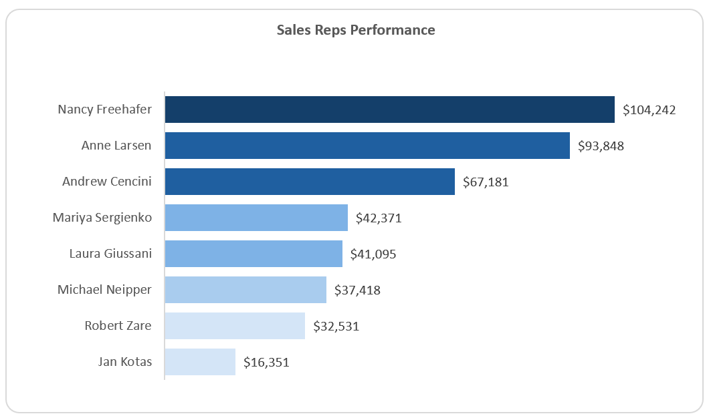
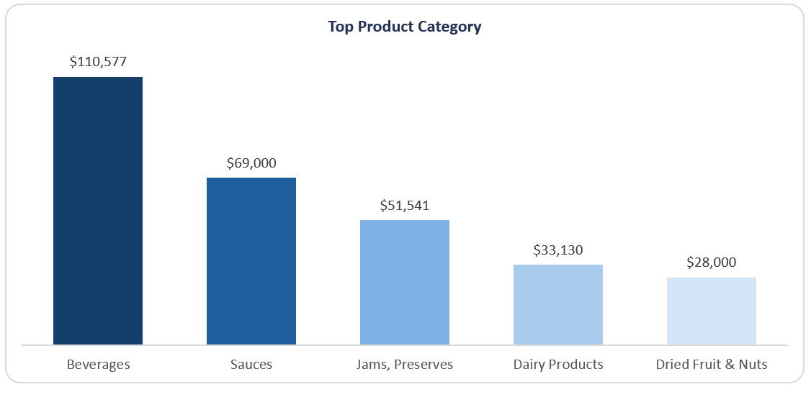
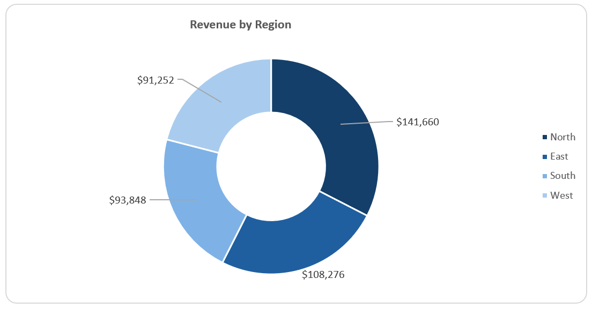
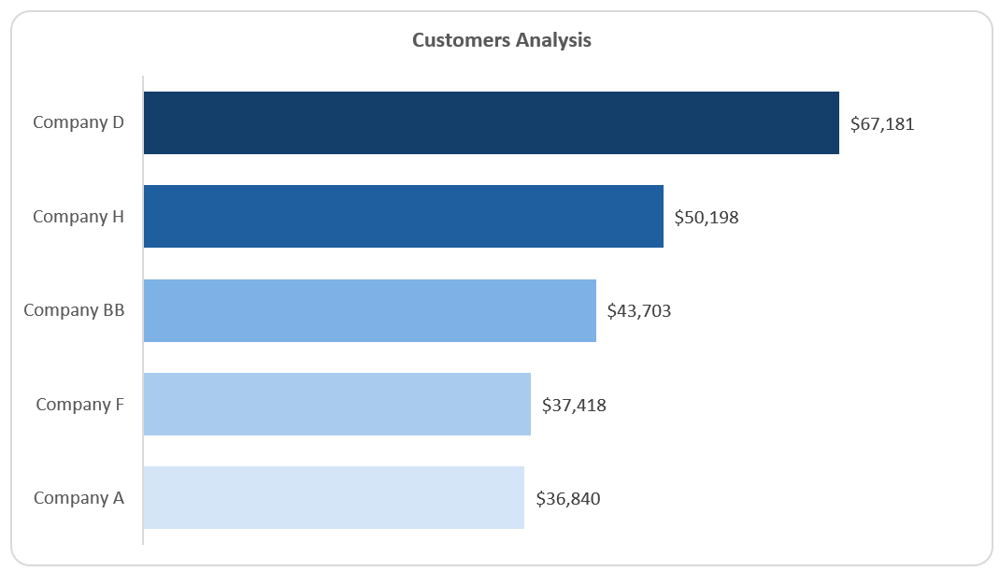

# Technical Report: Urban Store Sales Performance Analysis – 2019

## 1. Introduction
This report presents an analytical sales performance of an imaginary super Store Called **Urban Store**  for the year 2019. the project is to analyze and derive insights to answer crucial questions and help make data-driven decision. Using data visualizations and performance metrics, the dashboard helps to understand sales trends, regional and product category performances, and Sales Rep Performance.

**_Disclaimer_** _All datasets and reports do not represent any company, institution or country, but just a dummy dataset to demostrate capabilities of Microsoft Excel._
## 2. Overview
The dashboard consolidates sales data to reveal monthly revenue trends and patterns, top-performing cities, product categories, regions, and sales representatives. It enables business stakeholders to identify growth opportunities and operational inefficiencies. The major KPI is Revenue generation.
## 3. Problem Statement
Urban Stores seeks to identify the key drivers behind their sales performance, pinpoint underperforming areas (cities and regions), and understand customer and product dynamics. The ultimate goal is to improve strategic planning, product inventory, and regional expansion decisions. Analyze the sales data for 2019 and provide report for capturing the items listed below. An excellent report would aid management make strategic decisions for the coming year.
## 4. Skills Demonstrated
•	Data Cleaning and transformation
•	Dashboard design using Excel
•	Data visualization and storytelling
•	Business intelligence and KPI development
•	Analytical reasoning and reporting
## 5. Data Sources
The Dataset, containing records of:
•	Sales amounts
•	Product categories
•	Shipping and billing cities
•	Sales representatives
•	Customer companies
•	Transaction dates
## 6. Data Preparation
The data resided in a CVS file and was imported into Excel using the Power Query Capabilities. Each transaction was tagged with attributes such as month, sales region, city, and product category.
## 7. Data Profiling and Cleaning
Data quality checks were performed to handle missing values, Null, errors, outliers, and inconsistent labels. For example:
•	Duplicate transactions were removed.
•	Product categories were standardized.
•	Invalid or missing city names were corrected.

## 8. Analysis
### Trends Analysis

Sales peaked in December ($66,643) and dropped to their lowest in February ($19,956), highlighting potential seasonality or successful year-end campaigns.
Top City.
### City Performance

New York led all cities with $67,181 in revenue, followed by Portland and Miami, each contributing around $50,000.
### Top Sales Representative

Nancy Freehafer was the top performer with $104,242.34 in sales, indicating both consistent performance and potential leadership qualities.
### Top Product Category

Beverages accounted for the highest revenue at $110,577.10, followed by Sauces ($69,000) and Jams & Preserves ($51,541.00) and the Lowest being dried fruits. 
### Region Analysis

The Northern Region led in terms of overall performance with $141,660.34 in sales, followed by:
•	South: $108,275.51
•	West: $93,848.33
•	East: $91,251.98
This suggests that regional expansion efforts could be prioritized in the South and West, where solid growth potential exists. 
### Customer Analysis

Top customers by revenue include:
•	Company D: $67,181
•	Company H: $50,198
•	Company BB: $43,703
## 9. Insights Summary
•	New York is the most profitable city.
•	Nancy Freehafer is the top-performing sales rep.
•	Beverages is the best-selling Product category.
•	The Northern Region is the top sales region.
•	A small number of customers generate a significant portion of revenue.
•	Most transactions are in the lower amount ranges ($0–1000), pointing to high-frequency, low-volume sales.

## 10. Recommendations
1.	Expand in strong regions like the North and South, leveraging their high revenue performance.
2.	Invest in Top Reps: Develop mentorship or training programs using top performers like Nancy Freehafer. 
3.	Make Nancy Freehafer the employee of the year
4.	Stock high-demand products: Prioritize inventory and marketing for Beverages, Sauces, and Jams.
5.	Boost small-ticket value: Use promotions and bundle offers to raise the value of smaller transactions.
6.	Strengthen key customer relationships: Offer loyalty programs or exclusive deals to major customers like Company D to ensure retention.
7.	Seasonal planning: Prepare for high sales months, especially December, with robust inventory and marketing strategies.
8.	Recommend company D for a discount in the coming year to encourage more purchase and patronage. 
9.	Make company D the company of the year.
10.	Replicate measures deployed in December, in February and April. 
11.	Recommend that stakeholders inform all inventory staff to keep an eye on beverages in the coming year, so that they do not go out of stock.
12.	Set-up a HQ at Newyork to encourage more customers.
